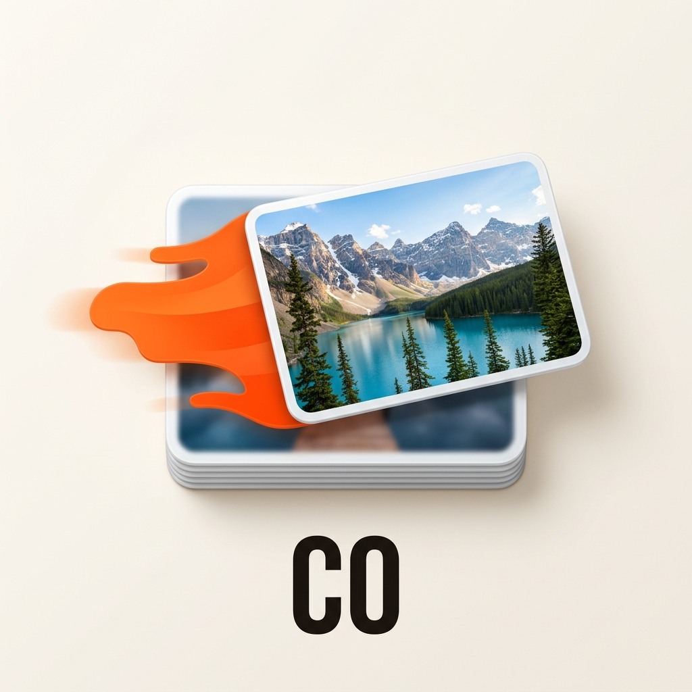
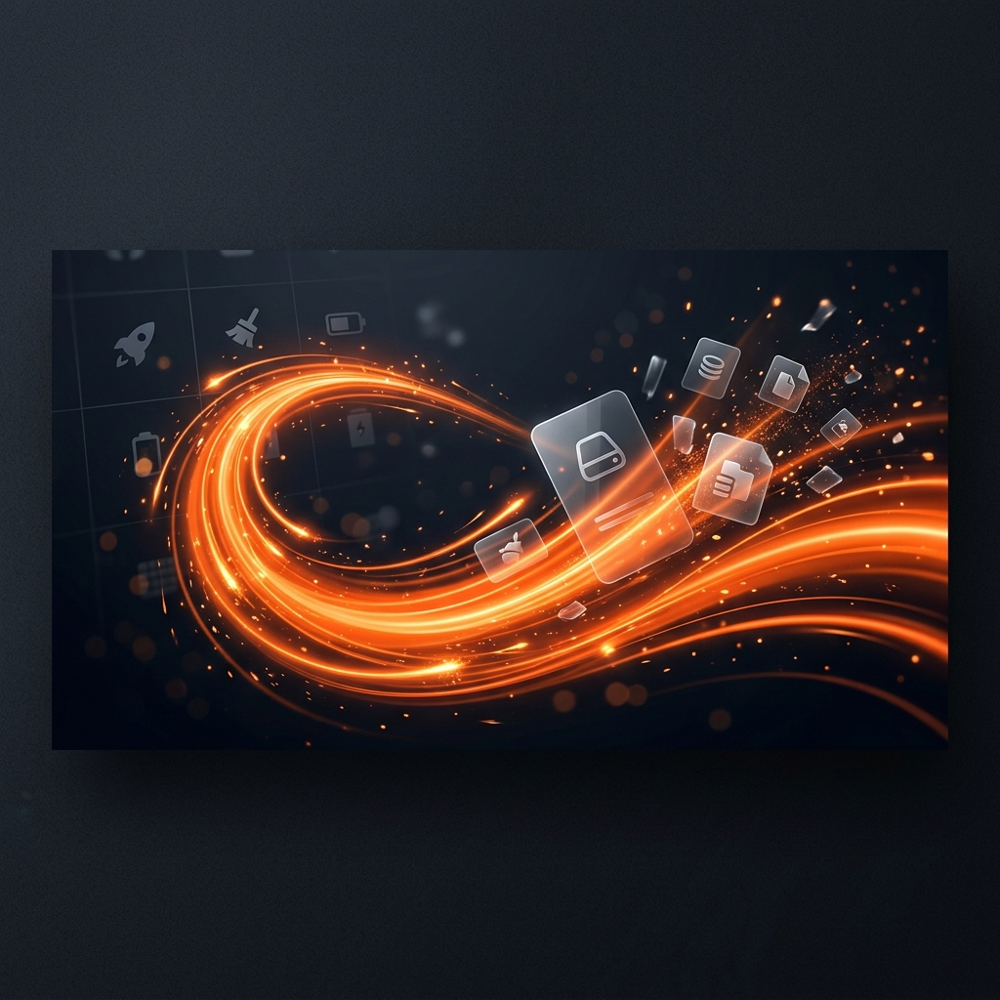
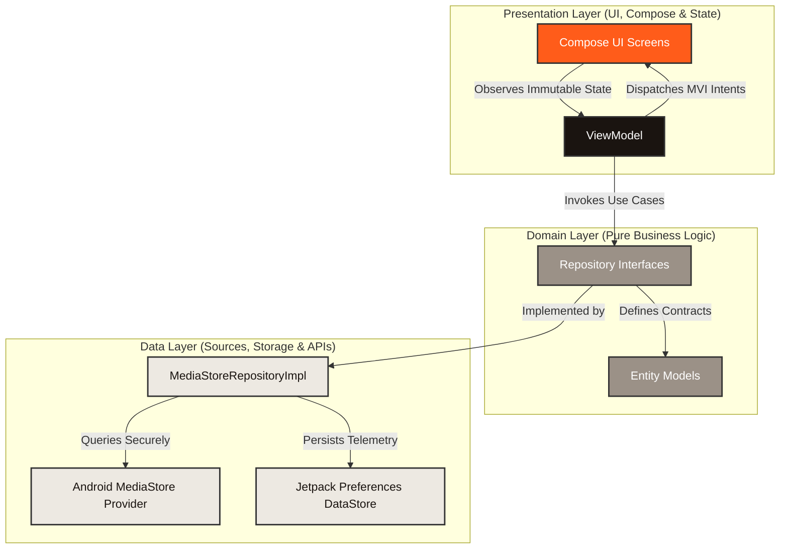

# ClearOut — Swipe. Free. Done. 📸📱

[](https://developer.android.com)
[](https://kotlinlang.org)
[](https://developer.android.com/jetpack/compose)
[](https://developer.android.com/jetpack/androidx/releases/glance)
[](https://developer.android.com/training/dependency-injection/hilt-android)
[](https://opensource.org/licenses/Apache-2.0)

**ClearOut** is a highly premium, privacy-first Android utility app engineered to help users declutter their device storage through a satisfying, gamified Tinder-style swipe interface. Built natively with **100% Jetpack Compose**, **Clean Architecture**, and the **MVVM/MVI State-Flow pattern**, ClearOut delivers a buttery-smooth, offline-first experience that transforms a tedious chore into an engaging daily habit.

---

## 🎨 Visual Identity & Mockups

| App Logo | Promo Feature Graphic | Interactive UI Mockup |
| :---: | :---: | :---: |
|  |  |  |

---

## 🚀 Key Features

*   **Tinder-Style Swipe Mechanics:** Fluid card deck gestures to rapidly organize gallery files. Swipe **right** to keep a memory, **left** to queue it for deletion.
*   **Physical Haptic Feedback:** High-fidelity tactile response matching the velocity and direction of card swipes to maximize kinesthetic satisfaction.
*   **Double-Layer Custom Splash Screen:** An elegant system-to-app intro transition featuring a branded spring-bounce icon animation, signature wordmark fade-in, and smooth navigation entry.
*   **Glance Home Screen Widgets (Glance API):**
    *   **Small Widget (2x1):** At-a-glance local storage cleared percentage and rapid app launcher.
    *   **Large Widget (4x2):** Rich gamification telemetry displaying cleared stats, total space freed (MB/GB), and 🔥 **Daily Streak** counts directly on the Android launcher.
*   **Privacy-First & Fully Offline:** Zero network requests. Operates 100% on-device using secure Android **MediaStore APIs** and high-speed **Jetpack Preferences DataStore**.
*   **Polished Safety Confirmation:** A double-check safety net under a clean `⋮` overflow menu on the HomeScreen that lets you reset statistics or clear stats with explicit warnings (*"Your photos will NOT be affected"*).
*   **Progress Sharing Engine:** Generates high-fidelity native `Bitmap` graphics off-thread combining dynamic text scaling, brand assets, and custom vector badges to easily share decluttering milestones.

---

## 🏗️ Architecture Design (HLD & LLD)

ClearOut is designed and built to withstand scaling, testing, and multi-developer collaboration, using strict **Clean Architecture** principles.

### High-Level Design (HLD)

The codebase isolates platform dependencies, business rules, and UI frameworks into three highly decoupled layers:



### Low-Level Design (LLD)

#### 1. Presentation Layer (`com.clearout.app.ui`)
*   **Dynamic Theme & Palettes:** Styled on a custom Material 3 Design System using physically warm tones—**Ink Black** (`#1A1410`), **Clearout Orange** (`#FF5C1A`), and **Soft Paper Cream** (`#F5F2ED`).
*   **MVI State Flow:** ViewModels capture actions (intents) like `SwipeLeft`, `Undo`, and `ConfirmDelete` and publish immutable UI states via `StateFlow` and transient one-time events (e.g., triggers for haptic feedback or share intents) via `SharedFlow`.

#### 2. Domain Layer (`com.clearout.app.domain`)
*   **Pure Kotlin Structure:** Completely free of Android SDK dependencies. Contains data entities (`Photo`, `GamificationStats`) and domain-level repository interfaces, ensuring unit testing can run locally in milliseconds.

#### 3. Data Layer (`com.clearout.app.data`)
*   **Android MediaStore API Integration:** Safely queries local media directories and manages localized cache structures to categorize files as pending, kept, or deleted.
*   **Jetpack DataStore:** Handles thread-safe, non-blocking disk writes using Kotlin Coroutines to store metrics (cleared photo counts, streak records, bytes saved).

---

## ⚡ Key Engineering Difficulties & Deep Learnings

Building a top-tier consumer utility on the Android platform requires overcoming strict API limitations, UI threading limits, and complex gesture physical systems.

### 1. Gesture Physics & State Sync in Compose Canvas
*   **The Challenge:** During rapid dragging in the Tinder-style photo deck, cards would occasionally lag, get stuck in mid-air, or suffer from index desyncs when photos were processed out of order.
*   **The Engineering Solution:** Built an advanced gesture handler leveraging Compose `pointerInput` and physics-backed `Animatable` bounds.
    *   Tied the animatable lifecycle directly to the individual photo ID using `remember(photo.id) { Animatable(0f) }` instead of index tracking, completely resolving state-desyncs.
    *   Implemented spring dynamics (`Spring.DampingRatioMediumBouncy` and `Spring.StiffnessLow`) inside thread-safe Coroutine scopes during `onDragCancel` to smoothly return or discard cards based on swipe thresholds.

### 2. High-Fidelity Custom Canvas Sharing Cards
*   **The Challenge:** Drawing Compose UI elements directly to a bitmap resulted in text clipping, hard-coded boundaries, and blurry scaling on high-DPI physical devices.
*   **The Engineering Solution:** Engineered a custom pixel-perfect drawing system using Android's native `Canvas` API.
    *   Calculated exact text bounds dynamically at runtime using `Paint.getTextBounds` loops to prevent character clipping.
    *   Synthesized the brand color scheme, custom typography, active telemetry statistics, and the Play Store download badge off the main thread, returning a compressed `Uri` directly to the system sharing sheet.

### 3. Jetpack Glance Remote Views Widget Interop
*   **The Challenge:** Updating Glance Home Screen Widgets with real-time gamification stats (cleared percentage, daily streaks) without causing rendering lag or blocking database writes.
*   **The Engineering Solution:** Created a reactive synchronization bridge.
    *   Leveraged Android `GlanceAppWidget` which compiles Compose layouts down to system `RemoteViews`.
    *   Structured a background listener inside `GamificationDataStore` that pushes telemetry states into preferences and triggers a broadcast widget update whenever a change occurs.
    *   Crafted lightweight placeholder layout previews (`widget_small_preview.xml` and `widget_large_preview.xml`) to satisfy compiler packaging requirements while using Glance state managers to handle visual dynamic rendering.

### 4. Gradle Version Catalog & Hyphenated Resolvers
*   **The Challenge:** Transitioning dependency management to Gradle's Kotlin DSL version catalog caused build-breaking errors such as `Unresolved reference` when accessing hyphenated identifiers.
*   **The Learning:** The Kotlin compiler processes hyphens mathematically (treating `libs.androidx-lifecycle` as `libs.androidx minus lifecycle`). Migrated the configuration to dot-delimited properties (`libs.androidx.lifecycle.ktx`) to enable type-safe, auto-completing DSL accessors.

---

## 📋 Technology Stack & Environment

*   **Minimum SDK:** Android 8.0 (API Level 26)
*   **Target SDK:** Android 14 (API Level 34)
*   **Development Language:** 100% Kotlin
*   **Asynchronous Processing:** Kotlin Coroutines & Flows
*   **UI Framework:** Jetpack Compose (Material 3)
*   **Home Widgets:** Jetpack Glance
*   **Dependency Injection:** Dagger-Hilt
*   **Image Loading:** Coil Compose
*   **Persistence:** Preferences DataStore

---

## 🛠️ Setting Up the Project Locally

Follow these steps to configure, build, and deploy the application locally:

### 1. Clone the Codebase
```bash
git clone https://github.com/kal-nemi/Clearout.git
cd Clearout/ClearOut
```

### 2. Isolated Secret Setup
To preserve credentials and prevent API / Keystore leaks, ClearOut decouples signing credentials into a local file:
1. Create a `keystore.properties` file in the root `ClearOut` directory:
   ```properties
   storeFile=debug.keystore
   storePassword=android
   keyAlias=androiddebugkey
   keyPassword=android
   ```
2. Build files parse this property safely during automated assembly:
   ```kotlin
   val keystorePropertiesFile = rootProject.file("keystore.properties")
   val keystoreProperties = Properties()
   if (keystorePropertiesFile.exists()) {
       keystoreProperties.load(FileInputStream(keystorePropertiesFile))
   }
   ```

### 3. Build & Run
1. Open Android Studio (Hedgehog or newer recommended).
2. Click **Open** and select the `/ClearOut` folder.
3. Allow Gradle to finish syncing.
4. Select `app` and run on an Emulator or physical Android device (`Control + R` on macOS).

---

## 🧪 Verification & Quality Control

### Automated Tests
To run unit and lint checks across the entire domain, business, and data layers:
```bash
./gradlew testDebugUnitTest
./gradlew lintDebug
```

### Manual Verification Checklist
1. **Swipe Interactions:** Rapidly swipe cards left and right to verify card spring mechanics and double-verify that the photo count increases.
2. **Splash Screen Sequence:** Kill the app process and relaunch. Verify that the bouncing icon transitions gracefully into the custom wordmark and home feed.
3. **Glance Widget Deployment:** Place the 2x1 and 4x2 widgets on the home screen. Verify that swiping cards in the main app updates the widgets' storage metrics and streak displays in real time.
4. **Safety Reset Menu:** Tap the `⋮` on the Home screen, click **Reset Stats**, and confirm. Verify that DataStore values return to zero and widget telemetry updates instantly.

---

## 🤝 Contribution Workflow

Contributions are highly welcomed! Follow our clean **Git-Flow** standards to submit updates:

1. **Fork the Repository:** Create a personal clone of the project.
2. **Create a Feature Branch:** Always branch off `main` using descriptive naming conventions:
   ```bash
   git checkout -b feat/your-feature-name
   # or
   git checkout -b fix/your-bug-fix
   ```
3. **Commit with Structure:** Follow standard conventional commit formatting:
   ```bash
   git commit -m "feat(widget): implement real-time streak rendering"
   ```
4. **Push & Open a PR:** Push your changes to your fork and submit a PR to `main` with a detailed list of additions and verification screenshots.

---

## 🗺️ Future Roadmap

- [ ] **On-Device ML Categorization:** Run lightweight local TensorFlow models to auto-cluster blurry media, duplicates, and screenshots.
- [ ] **Granular Media Filters:** Provide filters to specifically declutter videos, ultra-high-resolution files, or specific albums.
- [ ] **Interactive Haptic Tuner:** Allow users to custom-tailor vibration wave profiles for swiping actions.
- [ ] **Cloud Drive Cleaning:** Integrate with Cloud APIs (Google Drive, Dropbox) to swipe-clean remote cloud storage using the same native interface.

---

## 📄 License & Credits

Distributed under the Apache 2.0 License. See `LICENSE` for more information.

*Crafted with 🧡 by [kal-nemi](https://github.com/kal-nemi) — Swipe. Free. Done.* 🚀
