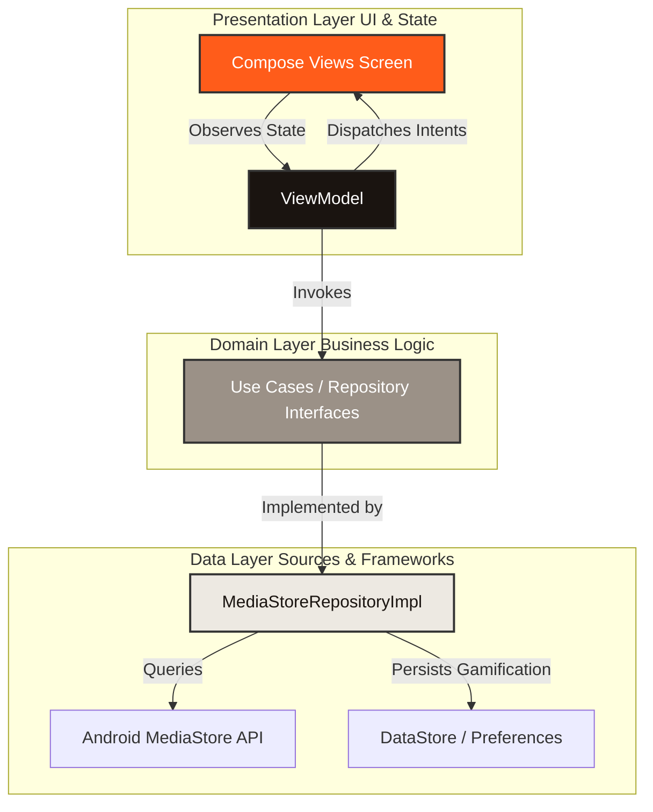

# ClearOut — Swipe. Free. Done. 📸📱

[](https://developer.android.com)
[](https://kotlinlang.org)
[](https://developer.android.com/jetpack/compose)
[](https://developer.android.com/training/dependency-injection/hilt-android)
[](https://opensource.org/licenses/Apache-2.0)

**ClearOut** is a highly premium, modern, and privacy-first Android utility app designed to help users declutter their device galleries through satisfying, intuitive Tinder-style swipe gestures. Built completely natively with **Jetpack Compose**, **Clean Architecture**, and **MVVM**, ClearOut delivers a buttery-smooth, offline-first experience to free up gigabytes of device storage in minutes.

---

## 🎨 Visual Identity

| App Icon | Feature Graphic |
| :---: | :---: |
|  | *Coming soon / Add Feature Graphic Link* |

---

## 🏗️ Architecture Design (HLD & LLD)

ClearOut is engineered following the strict principles of **Clean Architecture** combined with **MVVM** and **MVI-like State flow** patterns, ensuring high testability, maintainability, and clean separation of concerns.

### High-Level Design (HLD)

The application is structured into a classic 3-layer architecture:



### Low-Level Design (LLD)

- **Presentation Layer (`:app:ui`)**: 
  - Written entirely in **Jetpack Compose** using a customized Material 3 Design System that relies on physically warm colors (Ink Black `#1A1410`, Clearout Orange `#FF5C1A`, and Soft Paper Whites `#F5F2ED`).
  - ViewModels utilize Kotlin `StateFlow` to expose immutable UI State and `SharedFlow` to handle one-time side-effects (like triggering haptic feedback or starting a share intent).
- **Domain Layer (`:app:domain`)**: 
  - Pure Kotlin domain layer containing data models (`Photo`, `SwipeAction`) and repository abstractions. This layer has zero dependencies on Android framework components, ensuring it is highly unit-testable.
- **Data Layer (`:app:data`)**: 
  - Integrates directly with the Android **MediaStore API** to safely query, analyze, and bin physical photos into local memory structures.
  - Leverages **Jetpack DataStore (Preferences)** to persist local gamification stats (e.g., total space saved, number of photos cleared) offline with high performance.

---

## ⚡ Key Engineering Difficulties & Learnings

As a developer seeking to deliver a flawless consumer utility, building ClearOut presented complex platform and framework challenges. Here are the core technical achievements and learning milestones:

### 1. Advanced Gesture Physics & State Persistence (Compose Canvas)
*   **The Problem:** During drag events in the swipe interface, cards would occasionally get stuck "in mid-air" or lag when returning to their resting positions. Additionally, resetting states or swiping rapidly caused index desyncs.
*   **The Engineering Solution:** Built a dynamic gesture handler using Compose `pointerInput` and custom physics-based `Animatable` bounds. 
    *   Resolved index desyncs by tying the animatable state lifecycle directly to the photo ID using `remember(photo.id) { Animatable(0f) }` instead of a generic index.
    *   Implemented robust parallel snapback and exit transitions in `onDragCancel` using coroutines to run spring physics animation handlers asynchronously.

### 2. High-Fidelity Custom Canvas Rendering (Offline PNG Generation)
*   **The Problem:** The app offers a "Share Your Progress" feature. Directly rendering the Compose UI as a bitmap resulted in text clipping, scaling issues on high-DPI screens, and static watermarks.
*   **The Engineering Solution:** Engineered a custom drawing engine using Android's native `Canvas` API. 
    *   Created dynamic text-bounds calculation loops (`Paint.getTextBounds`) to prevent text clipping across various screen sizes.
    *   Engineered a high-fidelity sharing card combining the app’s warm brand color palette, real statistics (number of photos swiped, MBs cleared), and a custom vector Play Store download watermark.

### 3. Gradle Version Catalog Kotlin DSL Subtleties
*   **The Problem:** Gradle sync failed unexpectedly with an unresolved reference: `Unresolved reference. None of the following candidates is applicable because of receiver type mismatch...` when referencing version catalog variables.
*   **The Learning:** Discovered that Kotlin DSL interprets hyphenated catalog entries (e.g. `libs.androidx-lifecycle-ktx`) as a mathematical subtraction operation (`libs.androidx - lifecycle - ktx`). Migrated the configuration to dot-accessors (`libs.androidx.lifecycle.ktx`) to allow proper parser compilation.

### 4. AAPT Platform Theme Decoupling
*   **The Problem:** Android Asset Packaging Tool (AAPT) errors occurred when trying to link legacy XML themes in a pure Compose project: `Theme.Material3.Dark.NoActionBar not found`.
*   **The Learning:** Decoupled the project from legacy XML styling libraries and migrated the base parent theme in `themes.xml` to native platform templates (`android:Theme.Material`). Configured the app's visual style natively through the Compose `MaterialTheme` wrapper.

---

## 🛠️ Security & Secret Management

ClearOut is built with production security best practices in mind, preventing credential leakage in open-source environments:

- **Isolated Signing Credentials:** All keystore details, key aliases, and passwords are separated into `keystore.properties` (which is never committed to Git).
- **Automated Gradle Loading:** The release pipeline automatically parses the property files dynamically at build time:
  ```kotlin
  val keystorePropertiesFile = rootProject.file("keystore.properties")
  val keystoreProperties = Properties()
  if (keystorePropertiesFile.exists()) {
      keystoreProperties.load(FileInputStream(keystorePropertiesFile))
  }
  // Loaded securely inside signingConfigs { ... }
  ```
- **Robust Git Protection:** `.gitignore` actively ignores `.jks` binaries, `keystore.properties`, and local environments, ensuring the codebase remains open-source while locking down deployment keys.

---

## 📋 Requirements & Tech Stack

- **Min SDK:** Android 8.0 (API level 26)
- **Target SDK:** Android 14 (API level 34)
- **Language:** Kotlin 100%
- **DI Engine:** Dagger-Hilt
- **Asynchronous Flow:** Kotlin Coroutines & Channels
- **Image Loading:** Coil Compose
- **Local Database:** Preferences DataStore

---

## 🚀 Setting Up the Project Locally

Clone the repository and set it up locally in under 5 minutes:

1. **Clone the Repository:**
   ```bash
   git clone https://github.com/kal-nemi/Clearout.git
   cd Clearout
   ```
2. **Open in Android Studio:**
   - Launch Android Studio (Hedgehog or newer recommended).
   - Select **Open** and choose the `ClearOut` root folder.
   - Let Gradle sync complete.
3. **Build and Run:**
   - Click **Run** (`Control + R` on Mac) to deploy the debug version of the app to your emulator or physical device.

---

## 🤝 Contributing & Roadmap

We would love to collaborate with you! Feel free to open an issue or submit a pull request.

### Contribution Guidelines
1. Fork the project.
2. Create your Feature Branch (`git checkout -b feature/AmazingFeature`).
3. Commit your changes (`git commit -m 'Add some AmazingFeature'`).
4. Push to the Branch (`git push origin feature/AmazingFeature`).
5. Open a Pull Request.

### Upcoming Features (Roadmap)
- [ ] **Smart Categorization Engine:** AI-powered local classification to automatically group blurry photos, screenshots, and duplicates.
- [ ] **Multi-Select Fast Deletion:** A grid view allowing users to quickly check and delete hundreds of photos simultaneously.
- [ ] **Custom Haptic Patterns:** Deeply satisfying tactile response clicks matching different swipe intensities.
- [ ] **Cloud Drive Integration:** Connect to Google Drive / Dropbox to swipe-clean remote cloud backups locally.

---

## 📄 License

Distributed under the Apache 2.0 License. See `LICENSE` for more information.

---
*Created by [kal-nemi](https://github.com/kal-nemi)*. Swipe. Free. Done. 🚀
